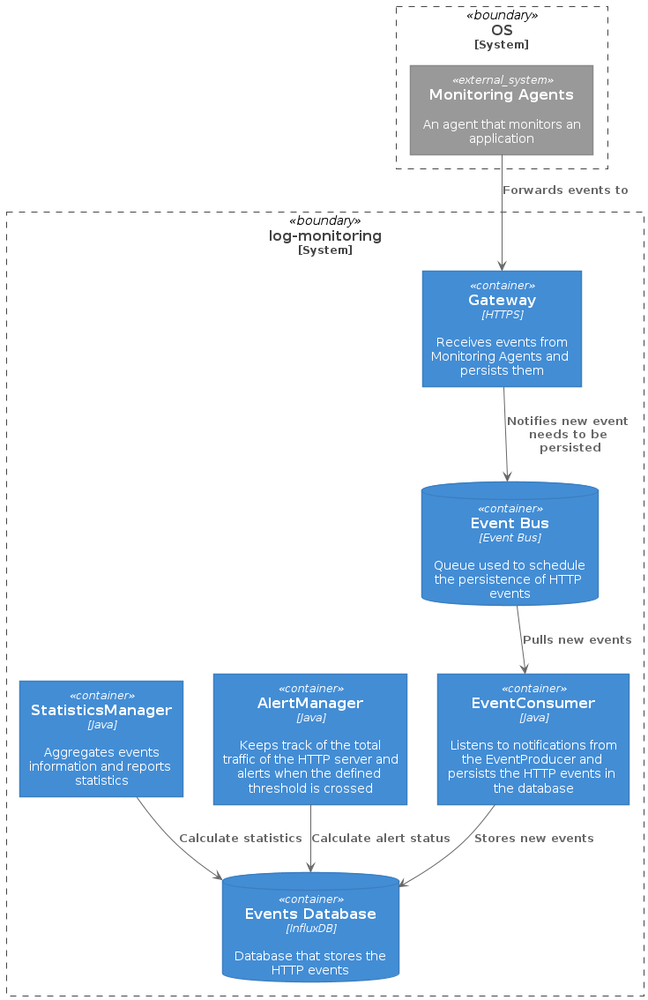

# Log Monitoring future ideas
In this document, I have captured some high level ideas on how this application could be extended to support real-life traffic.

Going in more detail is outside of the scope of this exercise but I am happy to discuss that separately.

The reviewed designed would be something like:

## Input processing
Instead of reading log files, a production-ready solution would collect those logs in real-time.

Product suites like DataDog or NewRelic provide agents that are deployed alongside the application that's being monitored and forward those logs in real time to the underlying platform.

Following a similar moderthe log monitoring app would need an API that those agents can post events to.

To ensure good performance an reliability, the only role of this API would be to rely these events to an internal event bus to be processed asynchronously.

## Timing
A production-ready solution would rely on UTC time instead of an internal time construct.

Processing real-time traffic at scale only means that the chances of getting delayed events will be higher. Thus, the architecture should be designed with that in mind to ensure it is as accurate as possible.

## Event persistence
InfluxDB provides functionality to scale out (through sharding) and to discard old data to prevent problems with storage.

That should be enough as a first step to provide a good read performance to generate statistics and alerts.

An usual pattern in the industry to balance storage and performance is to introduce the concept of "hot and cold" storage for events.

* Events that have been produced within a defined range (for example, 30 days) would be stored in the "hot storage" for quick access. InfluxDB is still a good fit for that.
* For events that were produced before that range, if there is still interest on persisting the data and assuming that it will be consulted less frequently, other storage solutions (commonly known as data lakes) would be a better fit.

# Statistics and alerting
Reporting statistics through console is not the most user-friendly solution. A better alternative would be to produce the same information in a more visual way through real-time charts on a web dashboard.

For alerting, the persistence model would need to be extended to be able to support multiple alerts with different alert conditions running at the same time.

Additionally, for resilience purposes, the alert management system would need to be resileint to application crashes or reboots. One way to do that would be through the persistence of snapshots of its alert evaluation cycle to ensure it can continue where it left off and eventually catch up after a potential short delay.

# Deployment model
The application was originally designed with a fair separation of responsibilities via threads.

My idea would be to continue on that direction and deploy separately those components (for example, as containers within a cluster).

This would reduce the blast radius of potential outages on specific components and ensure the rest of the system can still operate as expected.